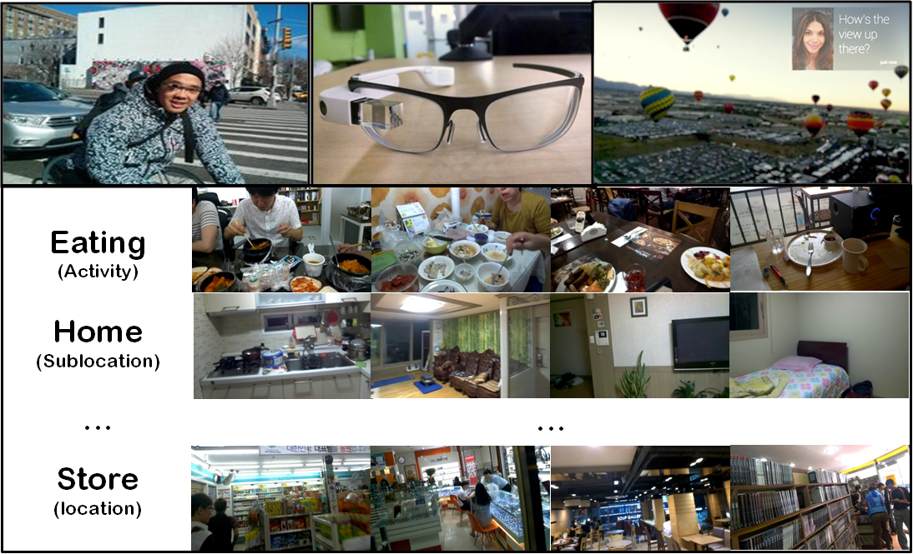

# Lifelog Dataset (v1.0)
## Main Reference
- "Dual Memory Neural Networks for Modeling Cognitive Activities of Humans via Wearable Sensors", S.-W. Lee, C.-Y. Lee, D.-H. Kwak, J.-W. Ha, J. Kim, and B.-T. Zhang, submitted to Neural Network Journal.

## Description

</img>

This dataset collect human life's activity data through Google Glass over 46 days from three participants.

## Data download link
- Participant A [[image feature](AlexNet_A.hdf5)] [[class](class_A.hdf5)] [[classinfo](classinfo_A.hdf5)]
- Participant B [[image feature](AlexNet_B.hdf5)] [[class](class_B.hdf5)] [[classinfo](classinfo_B.hdf5)]
- Participant C [[image feature](AlexNet_C.hdf5)] [[class](class_C.hdf5)] [[classinfo](classinfo_C.hdf5)]
